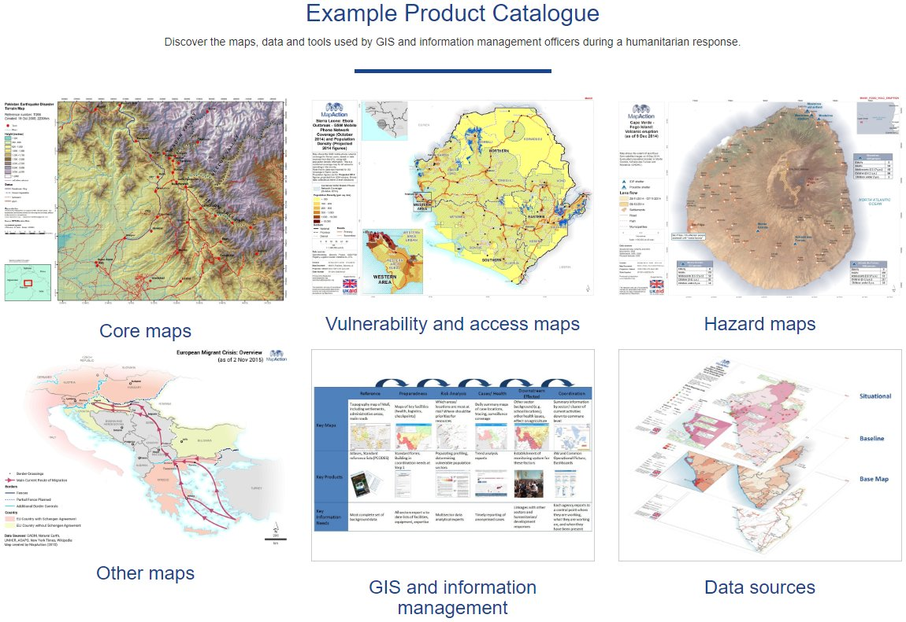

# Introduction

## What is the example product catalogue?

_Ever had some data and wanted it mapped but what to request or how it could be used? Do you make maps but haven't got experience in a particular type of response until now?_

Summarising the collective knowledge and experience of over 15 years of humanitarian mapping, the example product catalogue provides examples of the different types of humanitarian maps that can be produced at different stages during a response.

A collection of about 50 maps that can be found in a response form the basis of the example product catalogue and can be found at [guides.mapaction.org](https://guides.mapaction.org) which was initially funded by ECHO. 

For each example there is a short description of the map, some context as to what sort of information it is trying to convey and when it might be produced. Next there is a description of the intended audience and the type of decisions the map can help to inform - recognising that some times a map is made for reason but can often be used in different ways by other people. The final sections look at some of the methodologies and recommended data that may be used to create the maps - these are there to guide map producers on how to create the map as well as inform the user or someone requesting a map on the sort of data to provide.

## The food security example product catalogue

Since it the first version of the example product catalogue was released in 2017, new content has been added, developed and amended based on user feedback and experiences. Through a grant from OFDA we have developed the health section and are now looking to expand the section on food security. 

The remainder of this guide is an initial draft with real examples of the type of maps that have been produced where there has been food security concerns. These will be developed through interviews with food security experts. 

