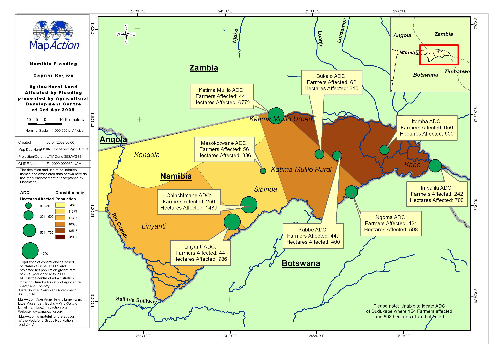

# Affected agriculture

## Description

Map shows the number of hectares and numbers of farmers affected in agricultural development centres across the Caprivi Strip against the total population in constituencies.

## Context

### Strategic or operational?

Operational

### Basemap, baseline or situational

Situational

### When might it be produced?

After assessment. Can be revised if better or more granular information becomes available.

## Audience

### Intended audience

* WFP
* FAO 
* Government Departments \(Department of Agriculture\)
* Civil Society
* Community Organisations
* Red Cross Societies
* Logistics Teams

### Influence on humanitarian decisions

Useful for food distribution agencies for establishing where staples, crops and livestock may be affected and understand how much food supply has been lost, and agricultural organisations in terms of what will be needed to restock or replant once disaster driver has been removed \(e.g. flood\).

## Methods

Access to timely and accurate data is essential for a Food Security response. It is important to get the best available data although it may not always be perfect. Questions should be asked such as:

* When was the data collected?
* What time period does it cover?
* When will it next be updated? 
* How accurate is the data?
* Are the figure actual, estimates or projections?
* What level of granularity is the data available at?  What area might the data be reflected on
* Is the data publically available, are there any restrictions on publishing?

A large amount of demographic data is publicly available online but consideration should be taken of any sensitivities that may relate to this data for example ethnicity. These sensitivities may lead to a decision to not place a certain dataset on a map.

Robust information management and governance is essential when accessing, storing and visualising Food Security data. The agreed use of the data must be established and recorded from the outset. "

## Data

* Administration Boundaries
* Population Census Data
* Topographic Data

  \*\* Roads

  \*\* Rivers

  \*\* Elevation

* Areas of land affected
* Numbers of Farmers Affected
* Preferable if some values on types of crop, number of livestock that have been lost.

## Resources

