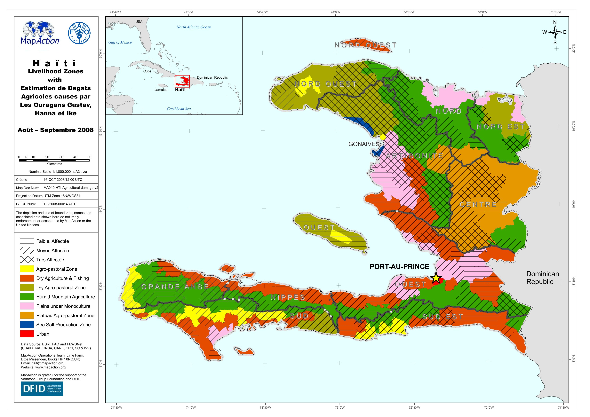

# Agricultural damage and livelihoods

### Description

Map shows the agricultural areas that have been affected by an emergency classed by severity overlaid onto livelihood zones.

### Context

#### Strategic or operational?

Strategic and operational

#### Basemap, baseline or situational

Situational

#### When might it be produced?

As early as possible in a response

### Audience

#### Intended audience

* WFP
* FAO
* Government Departments \(Department of Agriculture\)

#### Influence on humanitarian decisions

Useful for food distribution agencies for informing them where areas have been damaged that are used for agricultural/livestock production

### Methods

Using a simple basemap showing land use overlaid with the extent of areas affected by the disaster. The extent of those affected areas if possible should be ranked by severity. There might be a temporal element about the affected areas as this might change over time \(floods etc.\)

### Data

* Areas affected by disaster, if available classed by severity
* Land use

### Resources

