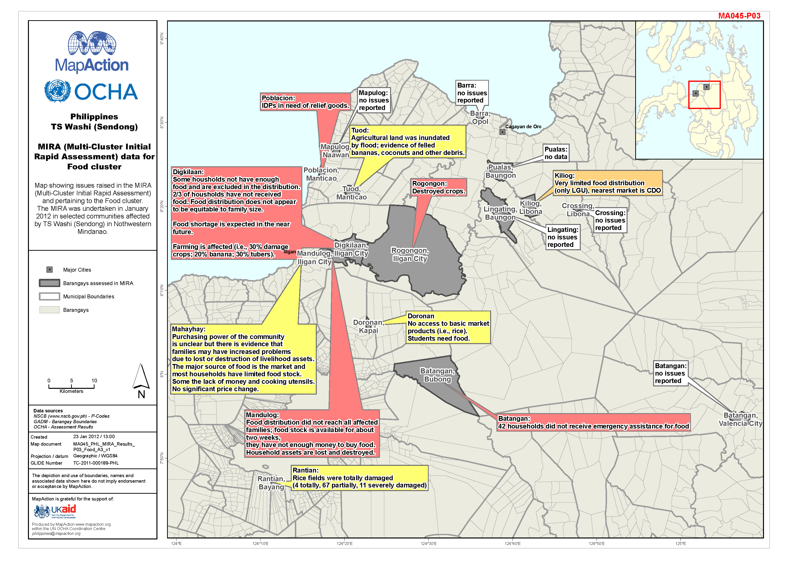

# Agriculture assessments

### Description

Maps shows issues related in the MIRA and pertaining to the Food cluster.

### Context

#### Strategic or operational?

Strategic

#### Basemap, baseline or situational

Situational

#### When might it be produced?

After MIRA or any other assessment.

### Audience

#### Intended audience

* WFP
* FAO
* Government Departments \(Department of Agriculture\)

#### Influence on humanitarian decisions

Will inform government and NGO response where aid is needed.

### Methods

Data collected to produce the map will come from the Multi-Sector Initial Rapid Assessment \(MIRA\). It is therefore really important that the MIRA assessment is conducted in such a way that the outcomes can be easily represented spatially.

### Data

* Administrative boundaries
* Populated places/
* P-Codes 
* Assessment results

### Resources

