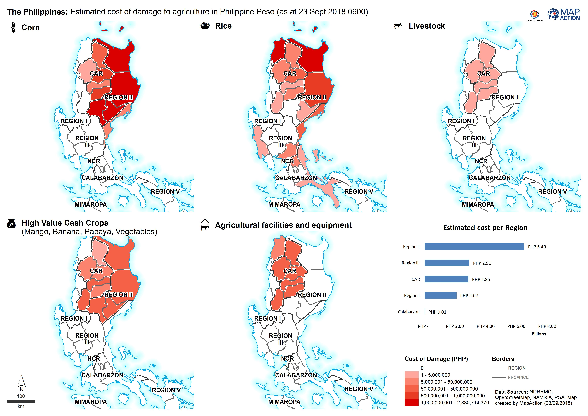

# Cost of damage on agriculture

### Description

Map shows the estimated cost of damage by province, to five agricultural themes - corn, rice, livestock, high value cash crops \(mango, banana, papaya, vegetables\) and agricultural facilities and equipment. The map also includes a bar graph of the total estimated cost per region.

### Context

#### Strategic or operational?

Strategic

#### Basemap, baseline or situational

Situational

#### When might it be produced?

After assessments

### Audience

#### Intended audience

* WFP
* FAO
* Government Departments \(Department of Agriculture\)

#### Influence on humanitarian decisions

The map will inform government and NGO response with a particular focus on where cash based transfers might be needed.

### Methods

Data collected to produce the map will come largely from government/NGO surveys of affected populations.

This will bring the requirement for additional metadata on the surveys themselves to understand the temporal elements \(date of collection, date of publication, frequency\), the geographic elements \(coverage, sampling frame\) and the quality elements \(modelling approach, uncertainty, confidence intervals\).

### Data

* Administrative Boundaries
* Agricultural survey data - type of farming, livestock populations, arable area, value of agricultural resources lost.

### Resources

