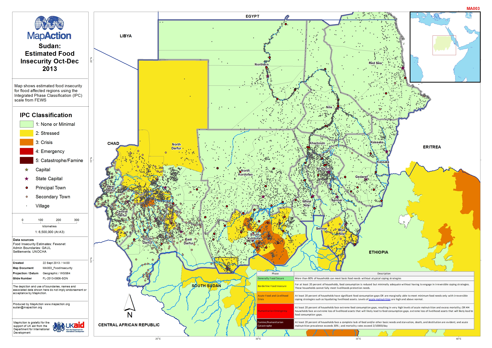

# Classifying food security

### Description

Map shows estimated food insecurity for flood affected regions using the Integrated Phase Classification \(IPC\) scale from FEWS

### Context

#### Strategic or operational?

Operational

#### Basemap, baseline or situational

Situational

#### When might it be produced?

As early as possible in a response

### Audience

#### Intended audience

* WFP
* FAO
* Government Departments \(Department of Agriculture\)
* Civil Society
* Community Organisations
* Red Cross Societies
* Logistics Teams

#### Influence on humanitarian decisions

The map will be one of the most important in a response for identifying priority areas where food insecurity needs are at their greatest.

### Methods

The map uses the existing IPC classification to identify whether regions are stressed, in crisis, in emergency or in catastrophe/famine.

The IPC uses survey data which will require an understanding of the metadata around temporal elements \(date of collection, date of publication, frequency\), the geographic elements \(coverage, sampling frame\) and the quality elements \(modelling approach, uncertainty, confidence intervals\).

The map also includes settlement locations and water bodies to provide context to the IPC data.

### Data

* IPC classification data

### Resources

