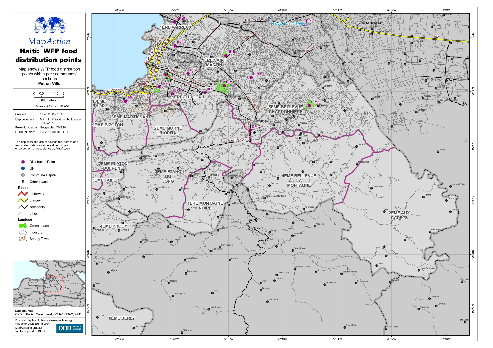

# Food distribution hubs

### Description

WFP food distribution points in earthquake affected zones.

### Context

#### Strategic or operational?

Operational

#### Basemap, baseline or situational

Situational

#### When might it be produced?

Distribution location, logistics and operational maps should be produced as the data becomes available and should be reviewed and updated regularly as the operations change.

### Audience

#### Intended audience

* WFP
* FAO
* Government Departments \(Department of Agriculture, Department of Health\)
* Communities
* Logistics cluster

#### Influence on humanitarian decisions

Will inform government and response where the operations are under way to distribute food, but also identify gaps. Additional information on the number of vulnerable or affected people \(nutrition indices\) would assist in identifying gaps in the response and help identify locations for more distribution centres Another improvement would be to combine where several agencies may be distributing food \(government , Red Cross\) as well as WFP/Food Cluster.

### Methods

Access to timely and accurate data is essential for a Food Security response. It is important to get the best available data although it may not always be perfect. Questions should be asked such as:

* When was the data collected? 
* What time period does it cover? 
* When will it next be updated? 
* How accurate is the data? 
* Are the figure actual, estimates or projections? 
* What level of granularity is the data available at? 
* What area might the data be reflected on Is the data publicly available, are there any restrictions on publishing?

A large amount of demographic data is publicly available online but consideration should be taken of any sensitivities that may relate to this data for example ethnicity. These sensitivities may lead to a decision to not place a certain dataset on a map.

Robust information management and governance is essential when accessing, storing and visualising Food Security data. The agreed use of the data must be established and recorded from the outset. "

### Data

* Topographic 
* Roads 
* Built up Areas 
* Populated Places 
* Administrative Boundaries 
* Food Security/Nutrition Indices 
* Locations of distribution points \(with ID numbers and possibly which agencies coordinates activity\)

### Resources

