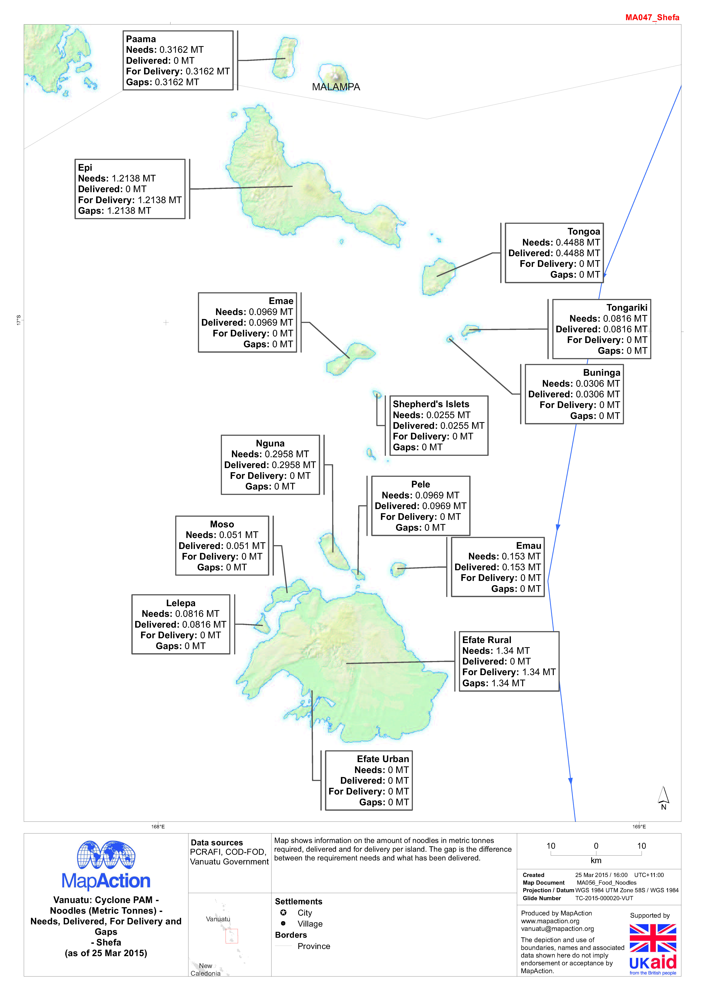

# Needs, delivered, planned and gaps

## 

### Description

Map shows information on the amount of noodles in metric tonnes required, delivered and for delivery per island. The gap is the difference between the requirement needs and what has been delivered.

### Context

#### Strategic or operational?

Operational

#### Basemap, baseline or situational

Situational

#### When might it be produced?

The map should be produced as the data becomes available and should be reviewed and updated regularly as the operations change

### Audience

#### Intended audience

* Government Departments
* National Disaster Management Agency
* FAO
* WFP 
* Red Cross Societies
* Civil Society
* Community Organisations
* Logistics Teams

#### Influence on humanitarian decisions

This map marries the amount of food estimated as needed for a critical period with the amount which has been delivered to date. This can be repeated for several different commodities.

### Methods

Using a simple basemap with administrative areas, text labels show the name of the administration area, and total for needs, delivered, for delivery, gaps. Can be programmed to pick up values in different columns so that a suite of maps for different commodities can be produced easily. A colour coded and symbology can enhance the visuals on the cartography.

### Data

* Food needs - quantities by weight, volume, number that is required for the location
* Food delivered - quantities by weight, volume, number that has been delivered to the location
* Food delivery planned - quantities by weight, volume, number that has been planned to be delivered
* Gaps - quantities by weight, volume, number that is still required baased on what is needed and what has been delivered

### Resources

