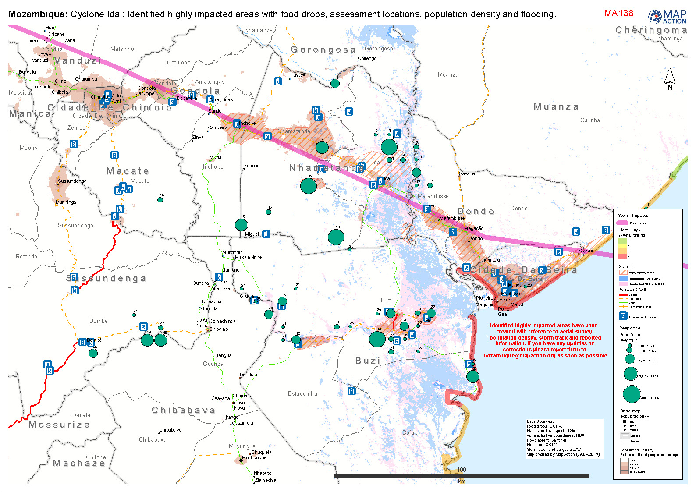

# Food delivery assessments

### Description

Map shows the storm track and flooding extent over time together with locations where assessments and food drops have been undertaken.

### Context

#### Strategic or operational?

Operational

#### Basemap, baseline or situational

Situational

#### When might it be produced?

The map should be produced as the data becomes available and should be reviewed and updated regularly as the operations change

### Audience

#### Intended audience

* WFP
* FAO
* Government Departments \(Department of Agriculture\)
* Civil Society
* Community Organisations
* Red Cross Societies
* Logistics Teams

#### Influence on humanitarian decisions

Will inform government and response where the operations are under way undertaking assessments and distributing food.

### Methods

Access to timely and accurate data is essential for a Food Security response. It is important to get the best available data although it may not always be perfect. Questions should be asked such as:

* When was the data collected?
* What time period does it cover?
* When will it next be updated? 
* How accurate is the data?
* Are the figure actual, estimates or projections?
* What level of granularity is the data available at?  What area might the data be reflected on
* Is the data publically available, are there any restrictions on publishing?

A large amount of demographic data is publicly available online but consideration should be taken of any sensitivities that may relate to this data for example ethnicity. These sensitivities may lead to a decision to not place a certain dataset on a map.

Robust information management and governance is essential when accessing, storing and visualising Food Security data. The agreed use of the data must be established and recorded from the outset. "

### Data

* Storm track
* Storm surge severity ranking
* Flood extent
* Road status
* Assessment locations
* Food drop
* Populated place
* Administrative areas
* Population density

### Resources

