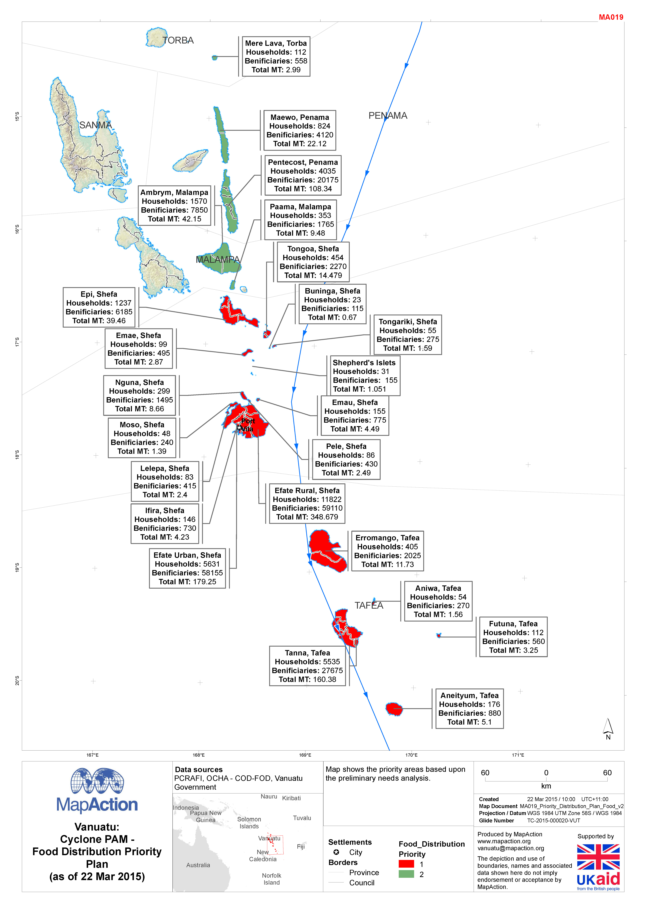

# Food distribution plan

### Description

Map shows the number of households, beneficiaries and total metric tons of distributed food by island and province in Vanuatu

### Context

#### Strategic or operational?

Operational

#### Basemap, baseline or situational

Situational

#### When might it be produced?

After assessment

### Audience

#### Intended audience

* WFP
* FAO
* Government Departments \(Department of Agriculture\)
* Civil Society
* Community Organisations
* Red Cross Societies
* Logistics Teams

#### Influence on humanitarian decisions

Will inform logistical decisions by government and NGOs on where food distribution requirements are not currently being met

### Methods

"Map is produced by identifying the number of beneficiaries against the total number of households by each island.

This will require survey data on the distribution of food which will generate a number of requirements for additional metadata to support map production. These are the temporal elements \(date of collection, date of publication, frequency\), the geographic elements \(coverage, sampling frame\) and the quality elements \(modelling approach, uncertainty, confidence intervals\)"

### Data

* Administrative boundaries
* Population and household survey/census data
* MIRA survey data on beneficiaries and total distribution

### Resources

